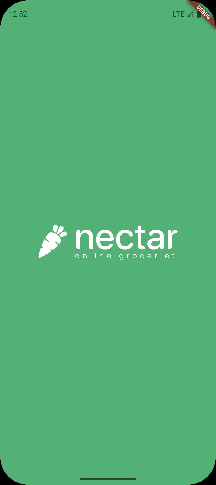
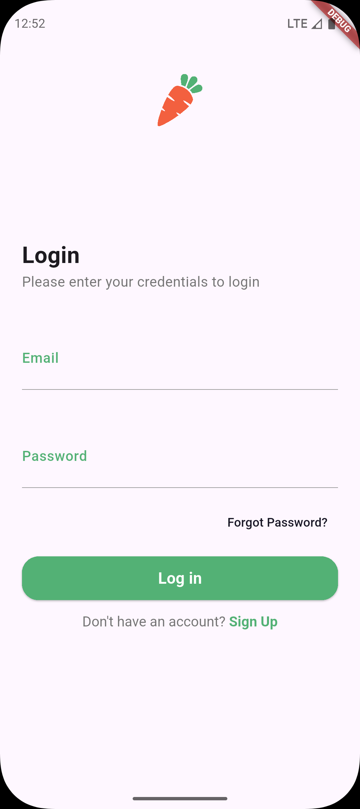
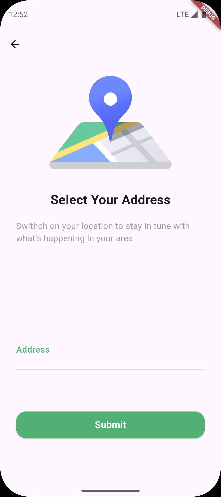
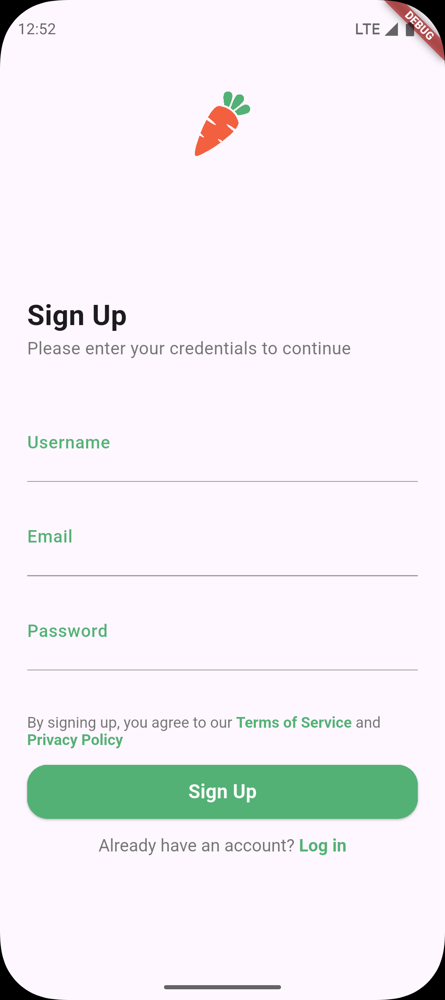

# 🍏 Nectar App

A modern grocery e-commerce Flutter application with a clean and intuitive UI.  
The app includes onboarding, authentication, and user-friendly forms to make shopping seamless.  

## ✨ Features

- **Splash Screen** – Displays a branded SVG splash before navigating to login.
- **Authentication** – Login page with email and password fields, and navigation to sign up.
- **Select Address** – Allows users to enter or choose their location.
- **Custom Components** – Reusable widgets like `CustomButton` and `CustomTextFormField` for consistent styling.

## 📱 Screens

1. **Splash Screen**  
   Shows the app logo and automatically navigates to the login page.

2. **Login Page**  
   - Email & password fields  
   - Validation-ready design  
   - "Sign Up" link with tappable navigation

3. **Select Address Page**  
   - Location illustration (SVG)  
   - Address input  
   - Submit button
  
## 📱 App GIF
| Nectar App |
|-------------------------------------------------------------------------------------------------|


## 📱 Screenshots

| Splash Screen | Login Page | Select Address | SignUp Page |
|---------------|-----------|----------------|----------------|
|  |  |  |  |


## 🛠 Tech Stack

- **Flutter** – Cross-platform UI toolkit
- **Dart** – Programming language
- **flutter_svg** – For rendering SVG assets

## 📂 Project Structure

```
lib/
├── components/
│ ├── custom_button.dart
│ ├── custom_text_form_field.dart
├── core/
│ ├── utils/
│ │ ├── app_colors.dart
│ ├── extensions/
│ ├── navigation.dart
├── feature/
│ ├── auth/
│ │ ├── pages/
│ │ ├── login_page.dart
├── splash_screen.dart
└── select_address_page.dart


